# Hybrid Bacterial Genome Assembly Pipeline

[](https://www.nextflow.io/)
[](https://sylabs.io/docs/)

A Nextflow pipeline for hybrid assembly of bacterial genomes using Illumina short reads and Oxford Nanopore long reads.

## Pipeline Overview

```mermaid
---
config:
  theme: mc
  themeVariables:
    fontSize: 40px
    width: 100%
    height: 1200px
    secondaryColor: '#ffffff'
    tertiaryColor: '#ffffff'
    background: '#ffffff'
  background: '#ffffff'
  layout: elk
---
flowchart LR
    n3["Illumina FastQ files"] --> n7["fastp"]
    n7 --> n8["Trimmed/filtered reads"]
    n5["porechop_ABI"] --> n9["Trimmed reads"]
    n9 --> n6["filtlong"]
    n6 --> n10["Filtered reads"]
    n1["Nanopore FastQ files"] --> n5
    n11["flye"] --> n12["Long read assembly"]
    n12 --> n13["unicycler <br>(existing_long_read_assembly)"]
    n15["Skip <br>Flye?"] -- Yes --> n22["unicycler <br>(hybrid mode)"]
    n22 --> n23["Hybrid assembly"]
    n23 --> n27["checkm2"] & n28["QUAST"]
    n13 --> n23
    n27 --> n30["Assembly stat reports (multiqc)"]
    n28 --> n30
    n15 -- No --> n11
    n8 --> n31(["Coverage checkpoint (d:30X)"])
    n31 --> n13
    n10 --> n32(["Coverage checkpoint (d:20X)"])
    n32 --> n15
    n3@{ shape: in-out}
    n7@{ shape: proc}
    n8@{ shape: lean-r}
    n5@{ shape: proc}
    n9@{ shape: lean-r}
    n6@{ shape: proc}
    n10@{ shape: lean-r}
    n1@{ shape: in-out}
    n11@{ shape: proc}
    n12@{ shape: lean-r}
    n13@{ shape: proc}
    n15@{ shape: diam}
    n22@{ shape: proc}
    n23@{ shape: lean-r}
    n27@{ shape: proc}
    n28@{ shape: proc}
    n30@{ shape: lean-r}
     n3:::data
     n7:::process
     n8:::data
     n5:::process
     n9:::data
     n6:::process
     n10:::data
     n1:::data
     n11:::process
     n12:::data
     n13:::process
     n15:::decision
     n22:::process
     n23:::data
     n27:::process
     n28:::process
     n30:::data
     n31:::checkpoint
     n32:::Peach
     n32:::checkpoint
    classDef process fill:#bbdefb,stroke:#1976d2,color:black
    classDef data fill:#c8e6c9,stroke:#388e3c,color:black
    classDef decision fill:#d3d3d3,stroke:#666666,color:black
    classDef Peach stroke-width:1px, stroke-dasharray:none, stroke:#FBB35A, fill:#FFEFDB, color:#8F632D
    classDef checkpoint fill:#f6cf92, stroke-width:1px, stroke-dasharray: 0, color:black
```



## Prerequisites

- **Nextflow** ≥ 23.04.0
- **Singularity/Apptainer**
- **Git**

## Quick Start

```bash
# Clone repository
git clone https://github.com/yourusername/listeria-hybrid-nf.git
cd listeria-hybrid-nf

# Download containers (run on node with internet access)
nextflow run main.nf -entry INSTALL -profile singularity

# If running on a node with no internet access, set this environment variables before running the pipeline
export NXF_OFFLINE=true

# Run pipeline
nextflow run main.nf \
  --input samplesheet.csv \
  --outdir results \
  -profile qib
```

## Documentation

For documentation, see the **[Wiki](https://github.com/talasjudit/listeria-hybrid-assembly-nf/wiki)**:

- [Installation](https://github.com/talasjudit/listeria-hybrid-assembly-nf/wiki/2.-Installation)
- [Configuration](https://github.com/talasjudit/listeria-hybrid-assembly-nf/wiki/3.-Configuration)
- [Pipeline Steps](https://github.com/talasjudit/listeria-hybrid-assembly-nf/wiki/4.-Pipeline-Steps)
- [Output Structure](https://github.com/talasjudit/listeria-hybrid-assembly-nf/wiki/5.-Output)

## License

MIT License - see [LICENSE](LICENSE) for details.

## Acknowledgements

Pipeline development assisted by AI pair programming (Claude/Gemini)
